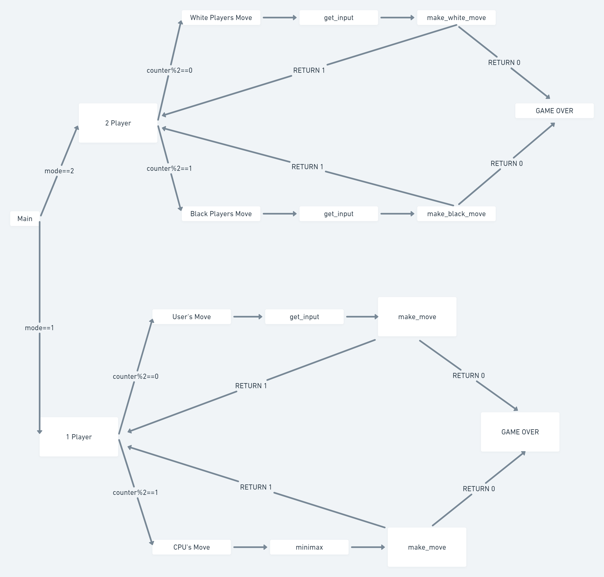
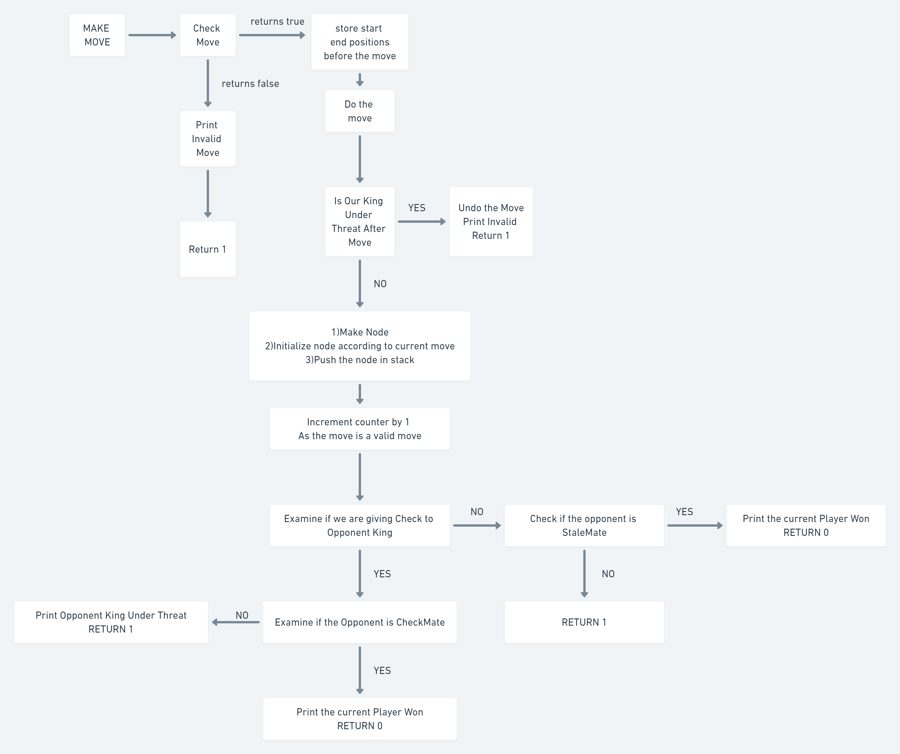
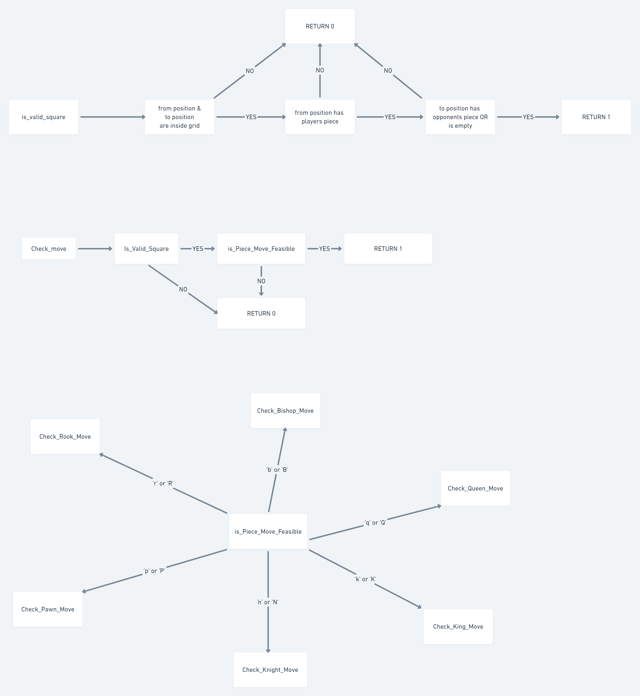
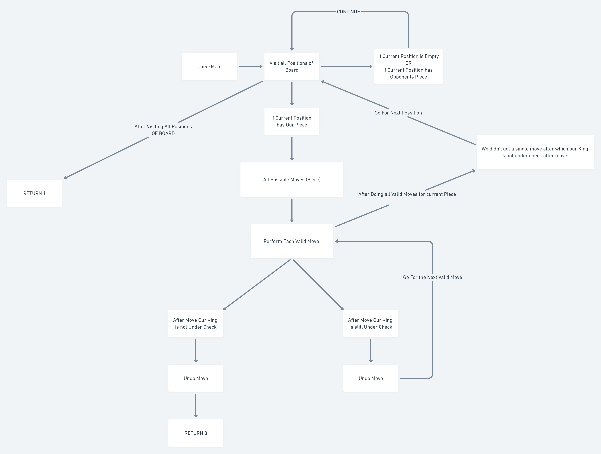

# Chess Engine in C

* Includes single player and two player modes.

* Contains all functions for validating moves and generating moves.

* Contains all functions to store all possible moves of a piece.

* Functions to detect Check, Checkmate and Stalemate.

* The Chess Engine works on an algorithm that is based on Minimax algorithm and alpha-beta pruning.

* The algorithm works fairly fast upto depth 4, but takes more than 1.5 minutes for depth 6. Odd depths are unreliable, as do not end with opponent's move.

## Compilation Instructions 

For dependencies: 
```
sudo apt-get update 
sudo apt-get install lesstif2-dev OR sudo apt-get install libmotif-dev
```

For compiling:
```
gcc engine.h engine.c main.c -lX11
./a.out
````

The program then accepts input for choice of mode and color.


## Working of Game Loop for 1 player and 2 player game

  
  
  
## Working of Make Move Function for Pieces

  
  
## Working of Check_Move Function and is_Move_Feasible Function

  
  
## Working of King under Threat Function

  

## Working of CheckMate

    
  

## Game Loop
Once the game starts, the game waits for user input. The input can be

[a-h][1-8]-[a-h][1-8]: a move which specifies the initial square (from) and the final square (to)

board: prints board again

The game checks whether the move is valid- if yes, it makes the move and updates the state accordingly
If invalid, the game simply goes to the next iteration of the game loop (and thus, tries again)

The state of the board and pieces is updated after each move. 

At every point, the *number of squares the piece  can move in a direction, along with the piece occupying the LAST square in that direction is stored*

When a move is made, for every piece, the program checks whether the *from* and *to* squares are in the range of the piece. It recalculates the moves of the piece in the direction from position of piece to the square. Only if the direction is a valid direction for the piece, dies it recalculate the pieces moves in that direction.

The program uses a set of number codes which represent a direction 

There are static arrays which store the delta-x and delta-y for that direction (which are used for move generation)

## Computer Player - CHESS ENGINE
There is a way to update the state of the board and possible moves of the piece for each move made
The Computer player uses the minmax algorithm, with alpha-beta pruning. 
Minmax uses a static evaluation function. The function has 3 main parameters-

Values of pieces

Number of squares controlled

King safety

The function uses these parameters to generate a number which represents the *goodness* of the position for white and black. A positive score is good for white, and negative for black. Minmax tries to *minimise* the score for black, and *maximise* the score for white. 
For example, for a depth-2 minmax, (assume white starts)

White tries ALL moves, and then for each move, calculates all possible moves for black. Now the score for the best move for black, is the score of that *branch*. Now, this is done recursively, with white doing MAX(minimise) ad black doing MIN(maximise)
Alpha beta pruning eliminates those moves in search using information about best move for black or white till that point.

The algorithm works fairly fast upto depth 4, but takes more than 1.5 minutes for depth 6. Odd depths are unreliable, as do not end with opponent's move.


### Problems

This does NOT implement *En-Passe*, due to complications arising out of using en-passe to kill a checking pawn, due to the final square not being the same as the square of the piece which is killed


### Possible Extension:

Build a better static evaluation function by anylisis of board position<-> win data

Interface with Xboard

Some kind of lookup table for fast checking of draw by repetition of *position*

Variable tree depth- when situation is dynamic(king in check or exchange going on) , look ahead more (modify the code in if (depth == 0))
